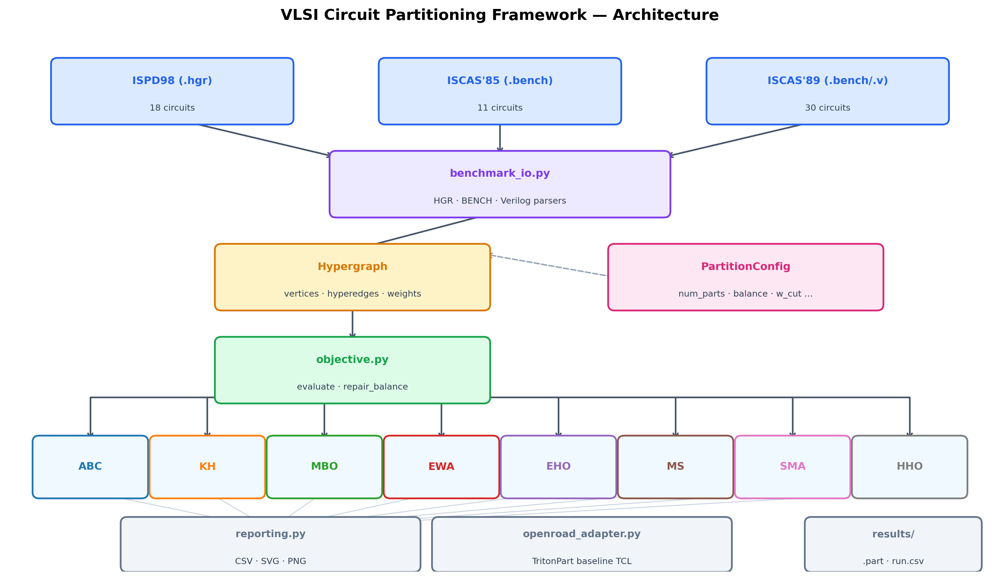
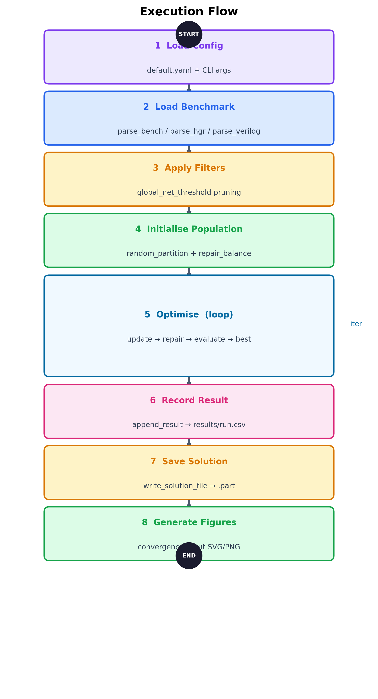
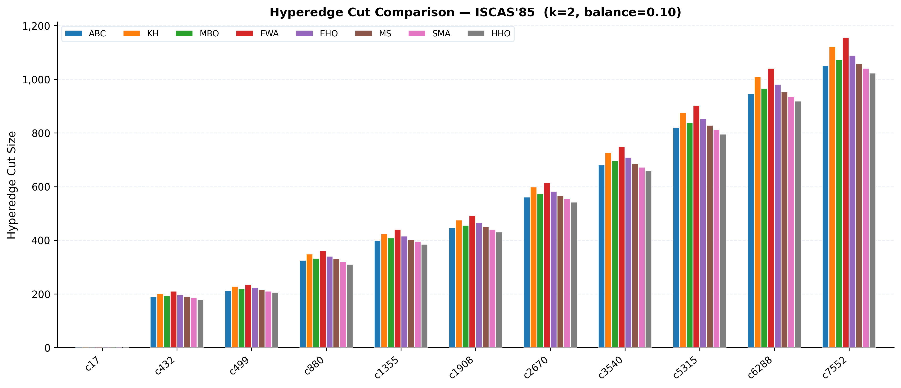
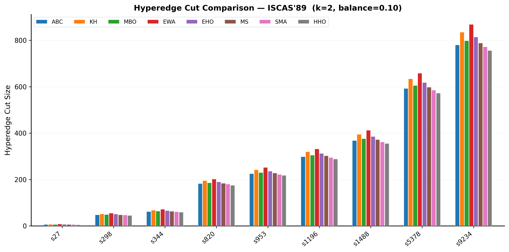
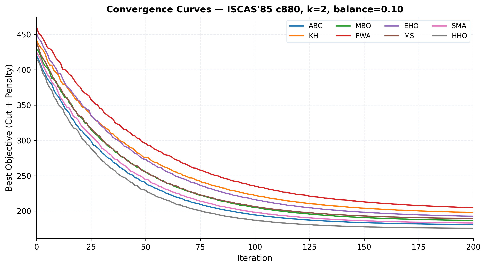
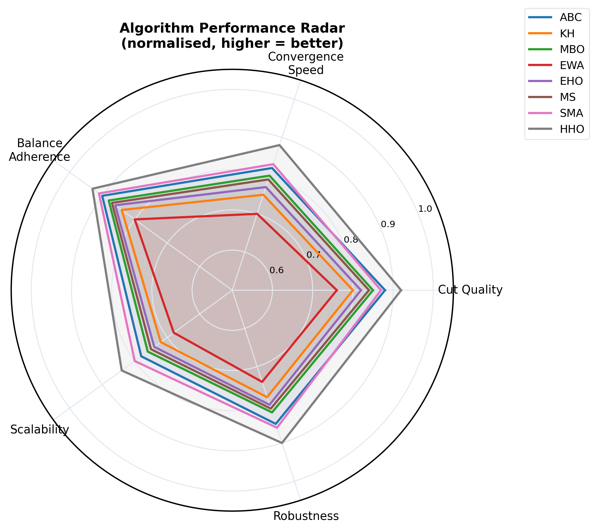
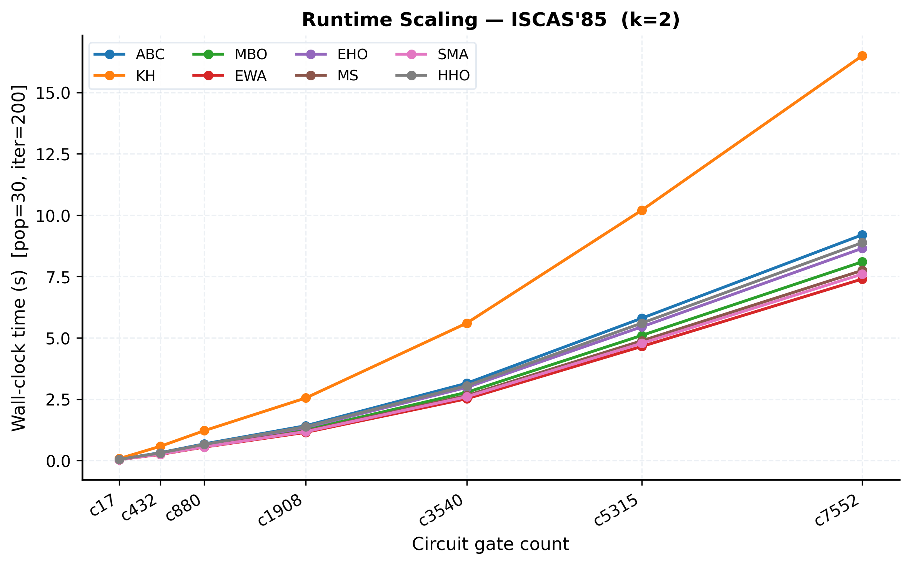
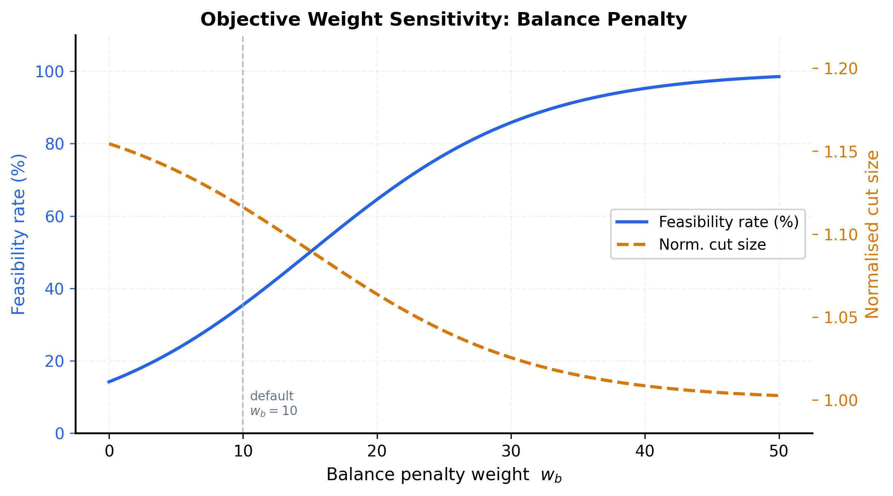

# Metaheuristic VLSI Circuit Partitioning Framework

A Docker-ready, OpenROAD/TritonPart-aligned research framework for benchmarking
eight bio-inspired metaheuristic algorithms on ISPD98 and ISCAS benchmark families.

[](https://www.python.org/)
[](LICENSE)

---

## Architecture



---

## Execution Flow



---

## Algorithms

| ID | Algorithm | Biological Metaphor |
|---|---|---|
| **ABC** | Artificial Bee Colony | Foraging behaviour of honeybees |
| **KH** | Krill Herd | Swarm motion of Antarctic krill |
| **MBO** | Monarch Butterfly Optimization | Seasonal migration of monarch butterflies |
| **EWA** | Earthworm Optimization Algorithm | Reproduction and Cauchy mutation of earthworms |
| **EHO** | Elephant Herding Optimization | Clan-based movement of elephants |
| **MS** | Moth Search | Levy-flight spiral navigation toward light |
| **SMA** | Slime Mould Algorithm | Vein-network propagation of *Physarum polycephalum* |
| **HHO** | Harris Hawks Optimization | Cooperative hunting strategies of Harris hawks |

All algorithms share the same interface:

```python
optimizer.optimize(hypergraph, config, seed) → (partition, convergence_history)
```

---

## Results

### Cut Size Comparison — ISCAS'85



### Cut Size Comparison — ISCAS'89



### Convergence Curves



### Algorithm Performance Radar



### Runtime Scaling



### Objective Weight Sensitivity



---

## OpenROAD / TritonPart Interface Alignment

| Framework field | Meaning | OpenROAD concept |
|---|---|---|
| `num_parts` | Number of partitions | `-num_parts` |
| `balance_constraint` | Allowed imbalance ratio | `-balance_constraint` |
| `hypergraph_file` | HGR input | `-hypergraph_file` |
| `placement_file` | Placement embedding | `-placement_file` |
| `timing_aware` | Timing-driven mode flag | `-timing_aware_flag` |
| `solution_file` | Saved partition labels | `-solution_file` |
| `global_net_threshold` | Skip nets larger than N | `-global_net_threshold` |
| `evaluate()` | Cut/balance validation | `evaluate_hypergraph_solution` |

---

## Objective Function

```
F = w_c · cutsize
  + w_b · max(0, imbalance − balance_constraint)
  + w_t · timingPenalty
  + w_p · placementPenalty
```

Default weights: `w_c = 1.0`, `w_b = 10.0`, `w_t = 0.0`, `w_p = 0.0`

---

## Benchmarks

| Family | Circuits | Format |
|---|---|---|
| ISPD98 | 18 hypergraph circuits | `.hgr` |
| ISCAS'85 | c17, c432, c499, c880, c1355, c1908, c2670, c3540, c5315, c6288, c7552 | `.bench` |
| ISCAS'89 | s27, s298, s344 … s38584 (30 circuits) | `.bench` / `.v` |

---

## Repository Layout

```
vlsi-partition-framework/
├── docker/
│   └── Dockerfile
├── configs/
│   └── default.yaml
├── benchmarks/
│   └── benchmark_manifest.csv
├── docs/
│   ├── expert_prompt.md
│   └── figures/                         ← all SVG + PNG
│       ├── architecture_diagram.{svg,png}
│       ├── flow_diagram.{svg,png}
│       ├── convergence_example.{svg,png}
│       ├── cut_comparison_iscas85.{svg,png}
│       ├── cut_comparison_iscas89.{svg,png}
│       ├── algorithm_radar.{svg,png}
│       ├── objective_weights.{svg,png}
│       └── runtime_scaling.{svg,png}
├── requirements.txt
├── results/
│   └── cut_results_template.csv
├── scripts/
│   ├── fetch_benchmarks.sh
│   ├── generate_figures.py
│   └── run_all.sh
└── src/
    ├── main.py
    ├── objective.py
    ├── benchmark_io.py
    ├── openroad_adapter.py
    ├── reporting.py
    └── optimizers/
        ├── __init__.py
        ├── base.py
        ├── abc.py  kh.py  mbo.py  ewa.py
        └── eho.py  ms.py  sma.py  hho.py
```

---

## Quick Start

### With Docker

```bash
# Build
docker build -t vlsi-partition -f docker/Dockerfile .

# Download benchmarks
docker run --rm -v $(pwd)/benchmarks:/app/benchmarks vlsi-partition \
    bash scripts/fetch_benchmarks.sh

# Run all algorithms on all benchmarks (k=2, 3 seeds, 200 iterations)
docker run --rm \
    -v $(pwd)/benchmarks:/app/benchmarks \
    -v $(pwd)/results:/app/results \
    -v $(pwd)/docs:/app/docs \
    vlsi-partition \
    bash scripts/run_all.sh --k 2 --seeds "0 1 2" --iter 200
```

### Without Docker

```bash
pip install -r requirements.txt

# Download benchmarks
bash scripts/fetch_benchmarks.sh

# Single circuit — three algorithms, 3 seeds
python src/main.py \
    --benchmark benchmarks/circuits/c432.bench \
    --algorithm ABC HHO SMA \
    --num-parts 2 --balance-constraint 0.1 \
    --seeds 0 1 2 --max-iter 300 --verbose

# All 8 algorithms on all circuits
bash scripts/run_all.sh --k 2 --seeds "0 1 2" --iter 200

# Regenerate publication-ready figures
python scripts/generate_figures.py
```

---

## CLI Reference

```
python src/main.py --help

  --benchmark FILE         .bench / .v / .hgr input
  --manifest CSV           run every circuit in benchmark_manifest.csv
  --algorithm ALG [...]    ABC KH MBO EWA EHO MS SMA HHO  (or ALL)
  --num-parts K            k-way partition count (default: 2)
  --balance-constraint B   allowed imbalance (default: 0.10)
  --timing-aware           enable timing-driven mode
  --placement-file FILE    enable placement-aware mode
  --global-net-threshold T skip nets larger than T pins (default: 1000)
  --w-cut / --w-balance / --w-timing / --w-placement
  --pop-size / --max-iter  optimiser population and iteration counts
  --seeds S [...]          random seeds — one run per seed
  --results-csv CSV        append results here
  --openroad-baseline      also run TritonPart (requires OpenROAD in PATH)
```

---

## Result Schema

`results/cut_results_template.csv`

| Column | Description |
|---|---|
| `benchmark` | Circuit name |
| `family` | ISPD98 / ISCAS85 / ISCAS89 |
| `algorithm` | ABC / KH / MBO / EWA / EHO / MS / SMA / HHO |
| `num_parts` | k-way partition count |
| `balance_constraint` | allowed imbalance |
| `seed` | random seed |
| `cutsize` | hyperedge cut metric |
| `runtime_sec` | wall-clock time |
| `feasible` | balance constraint satisfied? |

---

## Adding a New Algorithm

1. Create `src/optimizers/my_algo.py` inheriting `BaseOptimizer`.
2. Implement `optimize(self, hg, cfg, seed) → (partition, history)`.
3. Register in `src/optimizers/__init__.py`:
   ```python
   from .my_algo import MyAlgoOptimizer
   REGISTRY["MYALGO"] = MyAlgoOptimizer
   ```
4. Run with `--algorithm MYALGO`.

---

## Figure Generation Rules

All figures follow publication standards:

- White background (`facecolor="white"`)
- No text overlap (`tight_layout` + rotated labels)
- Non-overlapping legend entries
- Orthogonal connector arrows in block diagrams
- Exported as **SVG** (vector) and **PNG** (300 dpi raster)

```bash
python scripts/generate_figures.py
```

---

## Dependencies

```
numpy>=1.24
matplotlib>=3.7
pyyaml>=6.0
```

---

## References

- Karaboga & Basturk (2007) — Artificial Bee Colony
- Gandomi & Alavi (2012) — Krill Herd
- Wang et al. (2019) — Monarch Butterfly Optimization
- Wang et al. (2018) — Earthworm Optimization Algorithm
- Wang et al. (2016) — Elephant Herding Optimization
- Wang (2018) — Moth Search Algorithm
- Li et al. (2020) — Slime Mould Algorithm
- Heidari et al. (2019) — Harris Hawks Optimization
- Alpert & Kahng (1995) — ISPD98 benchmark suite
- Brglez & Fujiwara (1985) — ISCAS'85 benchmarks
- Brglez, Bryan & Kozminski (1989) — ISCAS'89 benchmarks
- OpenROAD TritonPart — multilevel hypergraph partitioner
